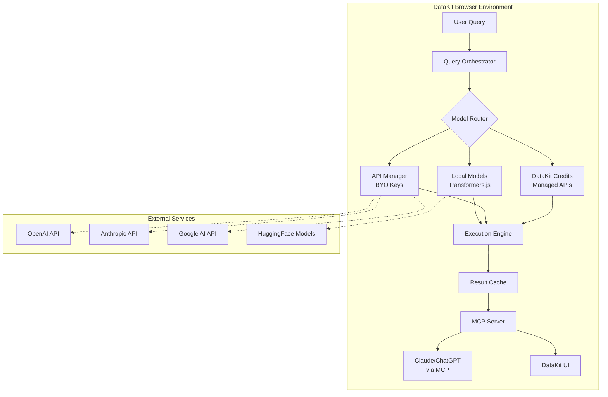

# DataKit AI/MCP Panel Implementation Plan

## Executive Summary

The AI/MCP Panel transforms DataKit from a data analysis tool into an intelligent data platform that bridges local data processing with AI capabilities. By implementing Model Context Protocol (MCP) support and offering flexible AI integration options (DataKit Credits, BYO API Keys, Local Models), we create a unique value proposition that addresses privacy, cost, and performance concerns while enabling powerful AI-driven data analysis.

**Target Launch:** Q1 2025  
**Development Time:** 12 weeks  
**Revenue Target:** $100K ARR within 6 months

## Vision Statement

> "Make DataKit the universal translator between your data and any AI - whether cloud, local, or hybrid - while keeping you in complete control of your costs, privacy, and performance."

## Core Value Propositions

### 1. **For Privacy-Conscious Users**
- Run AI models entirely in-browser using WebGPU
- Data never leaves your device unless you choose
- Complete GDPR/HIPAA compliance by default

### 2. **For Cost-Conscious Teams**
- Reduce AI costs by 80% through intelligent routing
- Use local models for simple queries (free)
- Cache results to avoid duplicate API calls

### 3. **For Power Users**
- Automatically select the best AI model for each query
- Combine multiple models for optimal results
- Create reusable query templates and workflows

### 4. **For Enterprises**
- Full audit trails and compliance reporting
- Air-gapped deployment options
- Team collaboration with shared resources

## Technical Architecture

### System Overview



### Component Breakdown

#### 1. **Query Orchestrator**
- Parses natural language queries
- Generates execution plan
- Optimizes for cost/performance
- Handles error recovery

#### 2. **Model Router**
- Evaluates query complexity
- Checks available models
- Selects optimal execution path
- Manages fallback strategies

#### 3. **Execution Engine**
- Manages concurrent executions
- Handles streaming responses
- Implements retry logic
- Monitors performance

#### 4. **MCP Server**
- Exposes DataKit data to AI assistants
- Manages secure connections
- Handles authentication
- Provides query interface

## Feature Specifications

### Phase 1: Foundation (Weeks 1-3)

#### 1.1 AI Panel UI
```typescript
interface AIPanelState {
  mode: 'credits' | 'byoKey' | 'local';
  activeModels: ModelConfig[];
  queryHistory: Query[];
  currentQuery: string;
  results: QueryResult[];
}
```

**UI Components:**
- Query input with syntax highlighting
- Model selector dropdown
- Results viewer with formatting
- Cost estimator display
- History sidebar

#### 1.2 Basic Query Execution
- Natural language to SQL conversion
- Simple data questions ("What's the average revenue?")
- Basic visualizations
- Error handling

#### 1.3 API Key Management
```typescript
interface APIKeyManager {
  providers: {
    openai?: { key: string; model: string };
    anthropic?: { key: string; model: string };
    google?: { key: string; model: string };
  };
  testConnection(): Promise<boolean>;
  secureStore(): void; // Uses browser encryption
}
```

### Phase 2: MCP Integration (Weeks 4-6)

#### 2.1 MCP Server Implementation
```typescript
interface DataKitMCPServer {
  // Core MCP methods
  async listDatasets(): Dataset[];
  async queryDataset(id: string, query: string): QueryResult;
  async getSchema(id: string): TableSchema;
  
  // DataKit specific
  async runSQL(sql: string): QueryResult;
  async getVisualization(config: VizConfig): VizResult;
}
```

#### 2.2 Authentication & Security
- OAuth flow for MCP connections
- Token management
- Rate limiting
- Access control per dataset

#### 2.3 Client Connectors
- Claude Desktop integration guide
- VSCode extension
- API documentation
- Example notebooks

### Phase 3: Local Model Support (Weeks 7-9)

#### 3.1 Model Management
```typescript
interface LocalModelManager {
  availableModels: ModelInfo[];
  downloadModel(modelId: string): Promise<void>;
  loadModel(modelId: string): Promise<Model>;
  deleteModel(modelId: string): void;
  
  // Storage management
  getStorageUsed(): number;
  pruneOldModels(): void;
}
```

#### 3.2 WebGPU Optimization
- Model quantization (8-bit, 4-bit)
- Batch processing
- Memory management
- Performance monitoring

#### 3.3 Supported Models
- **Text Generation:** Llama 2 7B, Mistral 7B, Phi-2
- **Code Generation:** CodeLlama, StarCoder
- **Specialized:** TimeGPT (time series), TabPFN (tabular)

### Phase 4: Advanced Features (Weeks 10-12)

#### 4.1 Hybrid Execution Engine
```typescript
interface HybridExecutor {
  async plan(query: Query): ExecutionPlan;
  async execute(plan: ExecutionPlan): Result;
  
  // Optimization strategies
  estimateCost(plan: ExecutionPlan): CostEstimate;
  optimizeForSpeed(plan: ExecutionPlan): ExecutionPlan;
  optimizeForCost(plan: ExecutionPlan): ExecutionPlan;
}
```

#### 4.2 Query Templates
```typescript
interface QueryTemplate {
  id: string;
  name: string;
  description: string;
  parameters: Parameter[];
  query: string;
  
  // Marketplace metadata
  author: string;
  price: number;
  rating: number;
  downloads: number;
}
```

#### 4.3 Performance Analytics
- Query execution metrics
- Cost tracking dashboard
- Model performance comparison
- Optimization recommendations

## Monetization Strategy

### Pricing Tiers

#### Free Tier
- 10 orchestrated queries/month
- 1 BYO API key
- 1 local model (manual setup)
- Basic MCP access
- Community support

#### Pro ($39/month)
- 1,000 orchestrated queries/month
- Unlimited API keys
- 5 local models with auto-management
- Advanced MCP features
- Query caching & optimization
- Email support

#### Teams ($99/month)
- Everything in Pro
- Shared workspace
- Team query library
- Centralized billing
- Audit logs
- Priority support

#### Enterprise (Custom)
- Everything in Teams
- Air-gapped deployment
- Custom model training
- SLA guarantees
- Dedicated support
- Compliance features

### Revenue Streams

1. **Subscription Revenue** (Primary)
   - Target: 5% free-to-paid conversion
   - Average revenue per user: $45/month

2. **Query Template Marketplace** (Secondary)
   - 30% commission on sales
   - Featured template slots: $99/month

3. **Enterprise Contracts** (Growth)
   - Custom deployments: $10K-50K
   - Annual contracts with support

4. **API Usage Overages** (Recurring)
   - $0.01 per query over limit
   - Bulk query packages available

## Go-to-Market Strategy

### Phase 1: Beta Launch (Month 1)

#### Target Audience: Data Analysts & Scientists
- **Message:** "Query your data with AI, without the complexity"
- **Channels:** 
  - DataKit existing users (email)
  - HackerNews launch
  - Data science Reddit communities
  - Twitter/LinkedIn thought leadership

#### Launch Incentives:
- 50% off Pro for beta users (lifetime)
- Free query template pack
- Early access to new features

### Phase 2: MCP Ecosystem (Month 2-3)

#### Target Audience: AI Power Users
- **Message:** "Turn DataKit into your AI's data brain"
- **Channels:**
  - Anthropic MCP directory
  - AI developer communities
  - YouTube tutorials
  - Developer documentation

#### Key Partnerships:
- Get listed in official MCP directory
- Collaborate with AI influencers
- Create MCP integration templates

### Phase 3: Enterprise Push (Month 4-6)

#### Target Audience: Data Teams
- **Message:** "Enterprise-grade AI data analysis with complete control"
- **Channels:**
  - Direct sales outreach
  - Webinar series
  - Case studies
  - Partner channel

#### Enterprise Features:
- SSO integration
- Advanced audit logs
- Custom deployment options
- SLA guarantees

## Success Metrics

### Technical KPIs
- Query success rate > 95%
- Average query time < 3 seconds
- Local model load time < 10 seconds
- MCP connection reliability > 99.9%

### Business KPIs
- Free to paid conversion: 5%
- Monthly recurring revenue growth: 20%
- User retention (6 month): 80%
- Net promoter score > 50

### Usage Metrics
- Queries per user per month
- API vs local model usage ratio
- Template marketplace adoption
- MCP connection activations

## Risk Mitigation

### Technical Risks

#### 1. **Browser Performance Limitations**
- **Risk:** Large models may not run well
- **Mitigation:** 
  - Aggressive model quantization
  - Cloud fallback options
  - Clear performance expectations

#### 2. **API Key Security**
- **Risk:** Exposed keys in browser
- **Mitigation:**
  - Browser encryption APIs
  - Optional proxy service
  - Security best practices guide

#### 3. **MCP Protocol Changes**
- **Risk:** Protocol is new and may change
- **Mitigation:**
  - Abstract MCP implementation
  - Maintain compatibility layer
  - Active participation in MCP community

### Business Risks

#### 1. **AI API Cost Volatility**
- **Risk:** Provider price changes affect margins
- **Mitigation:**
  - Focus on BYO key model
  - Emphasize local models
  - Dynamic pricing adjustments

#### 2. **Competition from Big Players**
- **Risk:** Google Sheets adds AI features
- **Mitigation:**
  - Focus on privacy/local execution
  - Build strong community
  - Move fast on new features

#### 3. **Low Conversion Rates**
- **Risk:** Users stick to free tier
- **Mitigation:**
  - Clear value proposition
  - Strategic feature gating
  - Usage-based triggers

## Development Timeline

### Week 1-2: Foundation
- [ ] AI Panel UI implementation
- [ ] Basic query interface
- [ ] API key management system
- [ ] Initial SQL generation

### Week 3-4: Core Features
- [ ] Query orchestrator
- [ ] Model router logic
- [ ] Result caching system
- [ ] Cost estimation

### Week 5-6: MCP Integration
- [ ] MCP server implementation
- [ ] Authentication system
- [ ] Claude integration guide
- [ ] Basic documentation

### Week 7-8: Local Models
- [ ] Transformers.js integration
- [ ] Model download manager
- [ ] WebGPU optimization
- [ ] Performance monitoring

### Week 9-10: Advanced Features
- [ ] Hybrid execution engine
- [ ] Query template system
- [ ] Marketplace infrastructure
- [ ] Analytics dashboard

### Week 11-12: Polish & Launch
- [ ] Bug fixes and optimization
- [ ] Documentation completion
- [ ] Marketing site updates
- [ ] Launch campaign

## Competitive Analysis

### Direct Competitors

#### 1. **Hex Magic**
- **Strength:** Established player, good UX
- **Weakness:** Server-based, expensive
- **Our Advantage:** Local execution, BYO keys

#### 2. **Observable AI Assist**
- **Strength:** Strong visualization
- **Weakness:** Limited to their platform
- **Our Advantage:** Works with any data source

#### 3. **ChatGPT Code Interpreter**
- **Strength:** Powerful AI
- **Weakness:** Data leaves your control
- **Our Advantage:** Privacy-first approach

### Indirect Competitors

#### 1. **Julius AI**
- Focus on chat interface
- We focus on integrated experience

#### 2. **Pandas AI**
- Python-only solution
- We're language agnostic

#### 3. **Langchain + DuckDB**
- Developer tool requiring setup
- We're ready out of the box

## Future Roadmap

### Q2 2025: Scale
- Custom model fine-tuning
- Team collaboration features
- Advanced visualization AI
- Mobile app companion

### Q3 2025: Expand
- Plugin marketplace
- White-label solution
- API for developers
- Streaming data support

### Q4 2025: Enterprise
- On-premise deployment
- Compliance certifications
- Advanced security features
- 24/7 support tier

## Conclusion

The AI/MCP Panel positions DataKit at the forefront of the AI-powered data analysis revolution. By offering flexibility in AI model choice, ensuring data privacy, and providing a seamless user experience, we create a unique product that serves everyone from individual analysts to large enterprises.

The key to success is rapid iteration based on user feedback while maintaining our core values of privacy, performance, and user control. With the right execution, DataKit can become the essential bridge between local data and AI intelligence.

## Appendix: Technical Details

### A. MCP Protocol Implementation
```typescript
// Example MCP server endpoint
class DataKitMCPServer implements MCPServer {
  async handleRequest(request: MCPRequest): MCPResponse {
    switch(request.method) {
      case 'query':
        return this.handleQuery(request.params);
      case 'schema':
        return this.handleSchema(request.params);
      // ... other methods
    }
  }
}
```

### B. Local Model Loading
```javascript
// Example using Transformers.js
import { pipeline } from '@xenova/transformers';

async function loadLocalModel(task: string) {
  const model = await pipeline(task, 'Xenova/LaMini-Flan-T5-248M');
  return model;
}
```

### C. Query Orchestration Example
```typescript
// Intelligent query routing
async function orchestrateQuery(query: string, context: Context) {
  const complexity = analyzeComplexity(query);
  
  if (complexity.score < 3 && context.hasLocalModel) {
    return executeLocal(query, context);
  } else if (complexity.requiresLatestData) {
    return executeCloud(query, context, 'gpt-4');
  } else {
    return executeHybrid(query, context);
  }
}
```